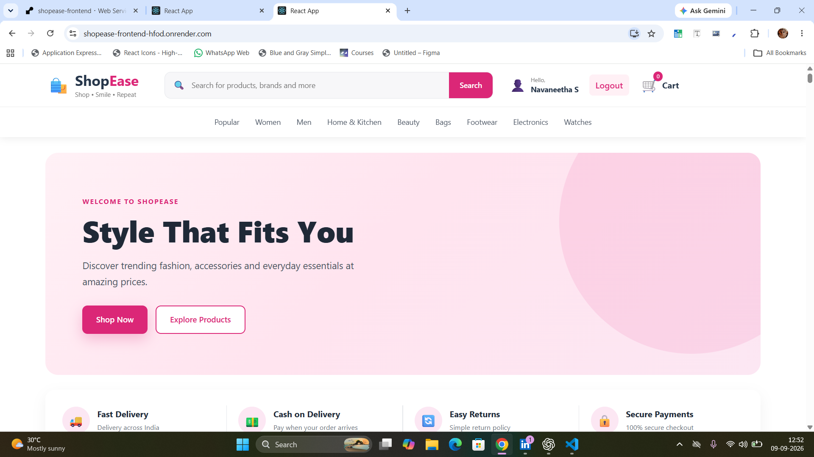

# 🛍️ ShopEase – Full Stack E-Commerce Website

<p align="center">
  
</p>

<p align="center">
  <b>A Full Stack E-Commerce Website built with React.js and Django REST Framework.</b>
</p>

<p align="center">
  <a href="https://shopease-frontend-hfod.onrender.com/">
    🌐 Live Demo
  </a>
</p>

A full-stack E-Commerce web application built using **React.js** for the frontend and **Django REST Framework** for the backend.

ShopEase provides a complete online shopping workflow including product browsing, product search, user authentication, address management, checkout, payment processing, and order management.

---

# 🌐 Live Demo

### 🛒 Live Website

🔗 https://shopease-frontend-hfod.onrender.com/

### 🔗 Backend API

🔗 https://shopease-backend-5flz.onrender.com/

> **Note:** The backend is hosted on Render. If the backend has been inactive for some time, the first request may take a few seconds while the service starts.

---

# 📑 Table of Contents

- [About the Project](#about-the-project)
- [Features](#features)
  - [User Features](#user-features)
  - [Product Features](#product-features)
  - [Address Features](#address-features)
  - [Payment Features](#payment-features)
  - [Order Features](#order-features)
  - [Admin Features](#admin-features)
- [Application Workflow](#application-workflow)
- [Application Overview](#application-overview)
  - [Home Page](#home-page)
  - [Product Listing](#product-listing)
  - [Product Details](#product-details)
  - [Search and Category](#search-and-category)
  - [User Registration](#user-registration)
  - [User Login](#user-login)
  - [User Account](#user-account)
  - [Account Update](#account-update)
  - [Address Management](#address-management)
  - [Checkout](#checkout)
  - [Payment](#payment)
  - [Payment Success](#payment-success)
  - [Order History](#order-history)
  - [Admin Order Management](#admin-order-management)
- [Technology Stack](#technology-stack)
- [Project Structure](#project-structure)
- [API Features](#api-features)
- [Authentication](#authentication)
- [Payment Workflow](#payment-workflow)
- [Installation](#installation)
  - [Prerequisites](#prerequisites)
  - [Backend Setup](#backend-setup)
  - [Frontend Setup](#frontend-setup)
- [Environment Configuration](#environment-configuration)
- [Running the Project](#running-the-project)
- [Deployment](#deployment)
- [Security](#security)
- [Future Enhancements](#future-enhancements)
- [Developer](#developer)
- [License](#license)

---

# 📌 About the Project

**ShopEase** is a full-stack e-commerce application developed to demonstrate the complete workflow of an online shopping platform.

The application allows users to:

- Browse products
- Search for products
- Filter products by category
- View product details
- Create an account
- Login securely
- Manage their profile
- Update account details
- Add and manage delivery addresses
- Proceed to checkout
- Enter payment details
- Complete the payment workflow
- Create orders
- View order history
- Logout securely

The application also provides admin functionality for managing products and monitoring customer orders.

---

# ✨ Features

## 👤 User Features

- User Registration
- User Login
- JWT Authentication
- User Profile
- Update Account Details
- Delete User Account
- Logout
- Protected User Routes

## 🛍️ Product Features

- Product Listing
- Product Details
- Product Search
- Category Filtering
- Product Images
- Product Price
- Stock Availability
- Product Description

## 📍 Address Features

- Add New Address
- View Saved Addresses
- Edit Address
- Delete Address
- Select Address During Checkout
- Indian Mobile Number Validation
- 6-Digit PIN Code Validation

## 💳 Payment Features

- Checkout Page
- Card Details Entry
- Card Validation
- Payment Confirmation
- Payment Processing
- Payment Success Response
- Order Creation
- Last Four Digits Handling

> **Note:** Payment functionality is configured in demo/test mode. Do not use real card details.

## 📦 Order Features

- Create Order
- View User Orders
- Display Order Details
- Payment Status
- Delivery Status
- Admin Order Management
- Update Delivery Status

## 👨‍💼 Admin Features

- Admin Authentication
- Product Management
- Order Management
- Delivery Status Update
- View Customer Orders

---

# 🔄 Application Workflow

```text
                    ┌───────────────┐
                    │   Home Page   │
                    └───────┬───────┘
                            │
                            ▼
                 ┌──────────────────┐
                 │ Product Listing  │
                 └────────┬─────────┘
                          │
                          ▼
                 ┌──────────────────┐
                 │ Product Details  │
                 └────────┬─────────┘
                          │
                          ▼
                    ┌────────────┐
                    │  Checkout  │
                    └─────┬──────┘
                          │
                          ▼
                 ┌─────────────────┐
                 │ Select Address  │
                 └────────┬────────┘
                          │
                          ▼
                 ┌─────────────────┐
                 │  Card Details   │
                 └────────┬────────┘
                          │
                          ▼
               ┌────────────────────┐
               │  Confirm Payment   │
               └──────────┬─────────┘
                          │
                          ▼
               ┌────────────────────┐
               │ Payment Processing │
               └──────────┬─────────┘
                          │
                          ▼
               ┌────────────────────┐
               │ Payment Successful │
               └──────────┬─────────┘
                          │
                          ▼
                   ┌──────────────┐
                   │ Order Created│
                   └──────┬───────┘
                          │
                          ▼
                   ┌──────────────┐
                   │  My Orders   │
                   └──────────────┘